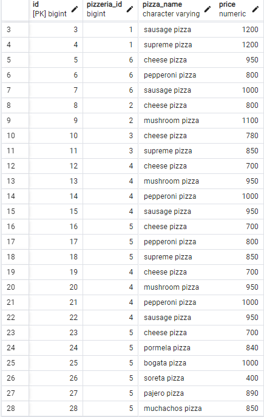

## 1 

```
insert into menu values (19,4,'cheese pizza', 700);
insert into menu values (20,4,'mushroom pizza', 950);
insert into menu values (21,4,'pepperoni pizza', 1000);
insert into menu values (22,4,'sausage pizza', 950);
insert into menu values (23,5,'cheese pizza', 700);
insert into menu values (24,5,'pormela pizza', 840);
insert into menu values (25,5,'bogata pizza', 1000);
insert into menu values (26,5,'soreta pizza', 400);
insert into menu values (27,5,'pajero pizza', 890);
insert into menu values (28,5,'muchachos pizza', 850);
```

```
insert into pizzeria values (7,'Pizza Sony','4.2');
insert into pizzeria values (8,'Pizza jony','4.7');
insert into pizzeria values (9,'Sinour','4.4');
insert into pizzeria values (10,'Potato pizza','4.8');
insert into pizzeria values (11,'Pizza Pablo','4.9');
insert into pizzeria values (12,'Pizza Soprano','4.0');
insert into pizzeria values (13,'Pizza Italia','3.5');
insert into pizzeria values (14,'Pizza Pepperoni','3.1');
insert into pizzeria values (15,'Pizza Porodala','4.9');
insert into pizzeria values (16,'Pizza Gavai','5.0')
```

```
insert into person_visits values (20, 4, 1, '2022-01-01');
insert into person_visits values (21, 2, 2, '2022-01-01');
insert into person_visits values (22, 5, 1, '2022-01-02');
insert into person_visits values (23, 3, 5, '2022-01-03');
insert into person_visits values (24, 3, 6, '2022-02-04');
insert into person_visits values (25, 4, 5, '2022-02-07');
insert into person_visits values (26, 4, 6, '2022-02-08');
insert into person_visits values (27, 5, 2, '2022-02-08');
insert into person_visits values (28, 5, 6, '2022-02-09');
insert into person_visits values (29, 6, 2, '2022-02-09');
```

```
insert into person_order values (21,4, 7, '2022-01-10');
insert into person_order values (22,5, 6, '2022-01-11');
insert into person_order values (23,5, 7, '2022-01-12');
insert into person_order values (24,6, 13, '2022-01-13');
insert into person_order values (25,7, 3, '2022-01-14');
insert into person_order values (26,7, 9, '2022-01-15');
insert into person_order values (27,7, 4, '2022-01-16');
insert into person_order values (28,8, 8, '2022-01-17');
insert into person_order values (29,8, 14, '2022-01-18');
insert into person_order values (30,9, 18, '2022-01-19');
```

```
insert into person values (16, 'Anna', 15, 'female', 'Voronej');
insert into person values (17, 'Andrey', 26, 'male', 'Novgorod');
insert into person values (18, 'Kate', 37, 'female', 'Kazan');
insert into person values (19, 'Denis', 17, 'male', 'Kazan');
insert into person values (20, 'Elvira', 45, 'female', 'Kazan');
insert into person values (21, 'Irina', 21, 'female', 'Saint-Petersburg');
insert into person values (22, 'Evgeniy', 24, 'male', 'Saint-Petersburg');
insert into person values (23, 'Nataly', 30, 'female', 'Novosibirsk');
insert into person values (24, 'Dmitriy', 18, 'male', 'Samara');
insert into person values (25, 'Grigoriy', 18, 'male', 'Samara');
```

## 2 


```
SELECT ("name", "age", "address") FROM "person" WHERE "address" = 'Moscow'
```

## 3 


```
SELECT ("name", "age", "address") FROM "person" WHERE "gender" = 'female' and "address" = 'Moscow' ORDER BY "name"
```

## 4

```
SELECT "name", "rating" FROM "pizzeria"
WHERE "rating" > 3.5
ORDER BY "rating" ASC;
```

## 5

```
SELECT "id" FROM "person_visits" WHERE "visit_date" BETWEEN '2022-01-01' and '2022-01-06' OR "pizzeria_id" = 2 ORDER BY "id"
```

## 6
 
```
SELECT "name" FROM "person" WHERE (SELECT "id" FROM "person_order" WHERE "menu_id" = 2) = "id"
```

## 7
```
SELECT EXISTS (SELECT "id" FROM "person" WHERE "name" = 'Kate')
```
